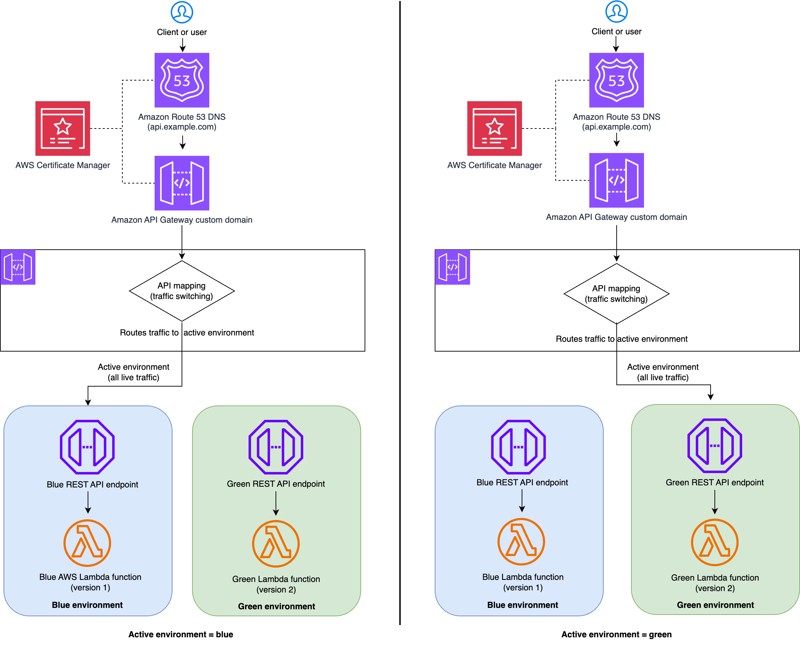

# Zero downtime blue/green deployments with Amazon API Gateway

This sample application demonstrates a blue/green deployment pattern for serverless applications using Amazon API Gateway custom domain names and API mapping. The solution showcases zero-downtime deployments for regional REST APIs implemented with API Gateway and AWS Lambda, deployed using SAM (Serverless Application Model) templates.

## Table of Contents

- [Overview](#overview)
- [Architecture](#architecture)
- [Prerequisites](#prerequisites)
- [Quick Start](#quick-start)
- [Cleanup](#cleanup)
- [License](#license)

## Overview

This project implements a complete blue/green deployment solution using:

- **AWS Lambda** with Python 3.13 runtime for serverless compute
- **Amazon API Gateway** with custom domain names for API management
- **AWS SAM** for Infrastructure as Code
- **Route53** for DNS management
- **ACM** for SSL/TLS certificates

The system uses a pet store API example. Note that this is a sample project to understand the concept and not for direct usage in production.

## Architecture

You’ll implement the following blue/green deployment architecture using Amazon API Gateway custom domain API mapping.



The blue/green deployment architecture consists of four primary components. When you access the API endpoint, Amazon Route53 resolves the domain to the API Gateway custom domain. API Gateway custom domain handles HTTPS termination using the configured ACM certificate and then routes the incoming request to the active environment.

- You’ll first setup the `blue` environment along with Route 53 DNS configuration and test it. 
- After that you'll deploy a new version of the application on `green` environment and test it using direct API Gateway URL while the live traffic is still being served from blue environment. 
- Then you’ll switch the traffic from `blue` to `green` using API Gateway custom domain API mapping without changing the external (client facing) API URL. At this point, the live traffic will be served by green environment. 
- If any issue observed during this time, you can quickly rollback to the `blue` environment and fix the `green` environment. 
- Or, if the `green` environment is stable, you’ll decommission that `blue` environment after some time.

**Key Benefits Illustrated:**
- **Zero Downtime**: Traffic switching happens at the API Gateway level
- **Quick Rollback**: Fallback to the previous stable version if issues occur
- **Environment Isolation**: blue and green environments are completely separate, preventing interference
- **Safe Testing**: New versions are thoroughly tested before receiving production traffic

This workflow ensures reliable, zero-downtime blue/green deployments while maintaining the ability to quickly recover from any issues that may arise in production during new version deployment.

## Prerequisites

### AWS Requirements

- [Create an AWS account](https://portal.aws.amazon.com/gp/aws/developer/registration/index.html) if you do not already have one and log in.
- Have access to an AWS account through the AWS Management Console and the [AWS Command Line Interface (AWS CLI)](https://aws.amazon.com/cli). The [AWS Identity and Access Management (IAM)](https://aws.amazon.com/iam) user that you use must have permissions to make the necessary AWS service calls and manage AWS resources mentioned in this post. While providing permissions to the IAM user, follow the [principle of least-privilege](https://docs.aws.amazon.com/IAM/latest/UserGuide/best-practices.html#grant-least-privilege).
- [AWS CLI](https://docs.aws.amazon.com/cli/latest/userguide/install-cliv2.html) installed and configured
- [Git Installed](https://git-scm.com/book/en/v2/Getting-Started-Installing-Git)
- [AWS Serverless Application Model](https://docs.aws.amazon.com/serverless-application-model/latest/developerguide/serverless-sam-cli-install.html) (AWS SAM) installed
- **[Route53 Public Hosted Zone](https://docs.aws.amazon.com/Route53/latest/DeveloperGuide/AboutHZWorkingWith.html)** for your domain
- **[ACM Certificate](https://docs.aws.amazon.com/res/latest/ug/acm-certificate.html)** for your custom domain in the target region

### Local Development

1. **Python 3.13++** installed
2. **Git** for version control

### Stack Structure

1. **Blue Stack** (`blue-green-api-blue`)
   - Blue API Gateway with `/v1` stage
   - Blue Lambda function
   - Outputs: API endpoint URL, API ID, and stage

2. **Green Stack** (`blue-green-api-green`)
   - Green API Gateway with `/v2` stage  
   - Green Lambda function
   - Outputs: API endpoint URL, API ID, and stage

3. **Custom Domain Stack** (`blue-green-api-custom-domain`)
   - API Gateway custom domain
   - Route53 DNS record
   - Base path mapping to active environment
   - Takes API ID/stage as parameters

## Quick Start


### 1. Clone and navigate to stacks directory (all commands run from here)

```bash
git clone https://github.com/aws-samples/sample-blue-green-deployment-with-api-gateway.git
cd blue-green-deployment-apigw-lambda/stacks
```

### 2. Deploy blue Environment
Run the following command to deploy the `blue` environment.

```bash
sam build -t blue-stack.yaml
sam deploy -g -t blue-stack.yaml
```

Enter the following details:
- **Stack Name**: <YourStackName> (e.g. blue-green-api-blue)
- **AWS Region**: Supported AWS Region (e.g. us-east-1)
- **BlueLambdaFunction has no authentication. Is this okay?**: `y`
- **SAM configuration file**: `blue-samconfig.toml`

Keep everything else to default values.

Make a note of the deployment output. Those will be used in the subsequent steps.

From next time onwards, if needed, you can run the following command to deploy:
```bash
sam build -t blue-stack.yaml
sam deploy -t blue-stack.yaml --config-file blue-samconfig.toml
```

### 3. Test the blue Environment
Run the following commands to test the blue environment. Replace `ApiEndpoint` with `BlueApiEndpoint`.


#### Health check API request:
```bash
curl --request GET \
  --url https://<ApiEndpoint>/health
```

Expected Response:
```bash
{
  "status": "healthy", 
  "environment": "blue", 
  "version": "v1.0.0", 
  "timestamp": "2025-09-05T13:11:11.248267Z"
}
```


#### Get pets API request:
```bash
curl --request GET \
  --url https://<ApiEndpoint>/pets
```

Expected response:
```bash
{
  "environment": "blue",
  "version": "v1.0.0",
  "pets": [
    {
      "id": 1,
      "name": "Buddy",
      "category": "dog",
      "status": "available"
    },
    {
      "id": 2,
      "name": "Whiskers",
      "category": "cat",
      "status": "available"
    },
    {
      "id": 3,
      "name": "Charlie",
      "category": "bird",
      "status": "pending"
    }
  ]
}
```


#### Create order API request:
```bash
curl --request POST \
  --url https://<ApiEndpoint>/orders \
  --header 'content-type: application/json' \
  --data '{
  "id": 1,
  "name": "Buddy"
}'
```

Expected response:
```bash
{
  "confirmationNumber": "ORD-3251C0F4", 
  "environment": "blue",
  "version": "v1.0.0",
  "timestamp": "2025-09-05T13:16:04.703666Z", 
  "data": 
  {
    "id": 1, 
    "name": "Buddy", 
    "status": "ordered"
  }
}
```

Validate that the response contains the `environment` attribute set to `blue` and `version` attribute set to `v1.0.0`.


### 4. Deploy Custom Domain pointing to blue environment
Run the following command to deploy to the Amazon API Gateway custom domain name and API mapping pointing to blue environment.
```bash
sam build -t custom-domain-stack.yaml
sam deploy -g -t custom-domain-stack.yaml
```

Enter the following details:
- **Stack Name**: <YourStackName> (Given a different stack name e.g. blue-green-api-custom-domain)
- **AWS Region**: Supported AWS Region (e.g. us-east-1)
- **PublicHostedZoneId**: Route53 public hosted zone ID (e.g. ABXXXXXXXXXXXXXXXXXYZ)
- **CustomDomainName**: Route53 domain name (e.g. `api.example.com`)
- **CertificateArn**: ACM certificate ARN (e.g `arn:aws:acm:us-east-1:123456789012:certificate/abc123`)
- **ActiveApiId**: Value of `BlueApiId` output from `blue-stack` deployment
- **ActiveApiStage**: Value of `BlueApiStage` output from `blue-stack` deployment
- **SAM configuration file**: `custom-domain-samconfig.toml`

Keep everything else to default values.

Make a note of the deployment output. Those will be used in the subsequent steps.

### 5. Test Production (live) Environment

Follow the test method mentioned in step #3 to test the Production (live). Replace `ApiEndpoint` with `CustomDomainUrl`.

Validate the Production (live) environment response contain the `environment` attribute set to `blue` and `version` attribute set to `v1.0.0`

### 6. Deploy green Environment

Run the following command to deploy the `green` environment.

```bash
sam build -t green-stack.yaml
sam deploy -g -t green-stack.yaml
```

Enter the following details:
- **Stack Name**: <YourStackName> (e.g. blue-green-api-green)
- **AWS Region**: Select the same region as blue environment (e.g. us-east-1)
- **GreenLambdaFunction has no authentication. Is this okay?**: `y`
- **SAM configuration file**: `green-samconfig.toml`

Keep everything else to default values.

Make a note of the deployment output. Those will be used in the subsequent steps.

From next time onwards, if needed, you can run the following command to deploy:
```bash
sam build -t green-stack.yaml
sam deploy -t green-stack.yaml --config-file green-samconfig.toml
```

### 7. Test the green Environment

Follow the test method mentioned in step #3 to test the Production (live). Replace `ApiEndpoint` with `GreenApiEndpoint`.

Validate that the response contains the `environment` attribute set to `green` and `version` attribute set to `v2.0.0`


### 8. Switch Custom Domain to green

Run the following command to switch the live traffic to the `green` environment.

```bash
sam deploy -g -t custom-domain-stack.yaml  --config-file custom-domain-samconfig.toml
```

Enter the following details:
- **Stack Name**: Keep it as is
- **AWS Region**: Keep it as is
- **PublicHostedZoneId**: Keep it as is
- **CustomDomainName**: Keep it as is
- **CertificateArn**: Keep it as is
- **ActiveApiId**: Value of `GreenApiEndpoint` output from `green-stack` deployment
- **ActiveApiStage**: Value of `GreenApiStage` output from `green-stack` deployment
- **SAM configuration file**: Keep it as is

Keep everything else to default values.

### 9. Test Production (live) Environment again

Follow the test method mentioned in step #3 to test the Production (live) again. Replace `ApiEndpoint` with `CustomDomainUrl`.

Validate that the response, now, contains the `environment` attribute set to `green` and `version` attribute set to `v2.0.0`. The live traffic is now switched to `green` environment.

If there was an issue, at this point, you have option to quickly switch the live traffic back to `blue` environment and fix the green environment.

Depending on which path you want to choose, follow either step 10A or 10B.

### 10A. Rollback to blue environment (if needed)

```bash
sam deploy -g -t custom-domain-stack.yaml  --config-file custom-domain-samconfig.toml
```

Enter the following details:
- **Stack Name**: Keep it as is
- **AWS Region**: Keep it as is
- **PublicHostedZoneId**: Keep it as is
- **CustomDomainName**: Keep it as is
- **CertificateArn**: Keep it as is
- **ActiveApiId**: Value of `BlueApiEndpoint` output from `blue-stack` deployment
- **ActiveApiStage**: Value of `BlueApiStage` output from `blue-stack` deployment
- **SAM configuration file**: Keep it as is

Keep everything else to default values.

Live traffic is switched to `blue` environment. You can confirm that by following the step# 3.


### 10B. Delete blue Environment (when no longer needed)

Run the following command to delete the `blue` environment when no longer needed. Replace `blue-stack-name` with you blue deployment stack name.

```bash
sam delete --stack-name <blue-stack-name> --no-prompts
```


## Cleanup

Run the below command to delete the stack when no longer used.

```bash

# Delete all stacks (in reverse order)
# Delete custom domain
sam delete --stack-name <api-custom-domain-stack-name> --no-prompts
# Delete green stack
sam delete --stack-name <green-stack-name> --no-prompts
# Delete blue stack, if already not deleted in step 10
sam delete --stack-name <blue-stack-name> --no-prompts
```


## License

This project is licensed under the MIT-0 License. See the LICENSE file for details.